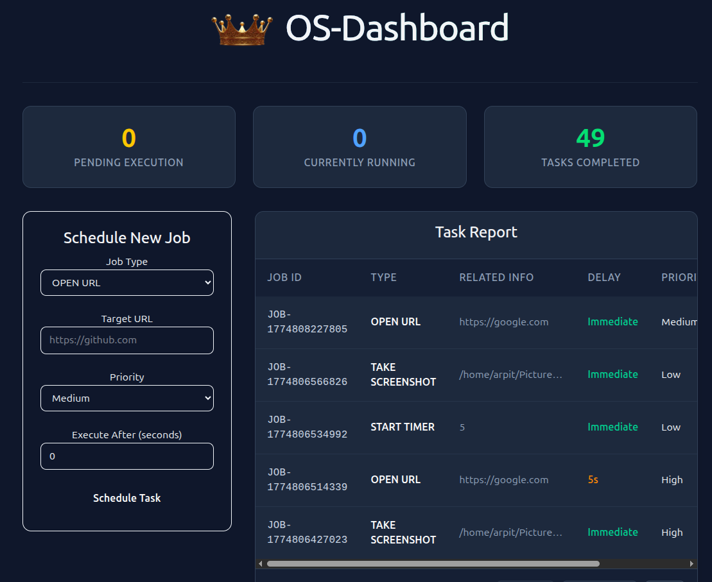

<h1 align="center">
   
  OS Dashboard & Background Scheduler
</h1>

<p align="center">
  <em>A high-performance, full-stack system automation dashboard built with React and a Multithreaded C++ microservice.</em>
</p>

<p align="center">
  
  
  
  
  
</p>

---

## 📸 See it in Action



### 🎥 Video Demo
Click the image below to watch a full video breakdown of the multithreaded daemon executing background tasks:

[](https://youtu.be/e9ZFx8cg0gw)

---

## 🚀 Features

* **C++ Microservice Backend:** Built with the Crow C++ micro-framework for hyper-fast HTTP routing and JSON parsing with virtually zero memory overhead.
* **Multithreaded Worker Daemon:** Uses `std::thread` to process concurrent background tasks (timers, media playback, system commands) without blocking the main event loop.
* **SQLite Job Ledger:** A robust, lock-managed database queue (`sqlite3_busy_timeout`) to track pending, running, and completed jobs securely.
* **Systemd Integration:** Runs completely detached in the background as user-level Linux services, ensuring it survives system reboots.
* **React + Tailwind Frontend:** A sleek, responsive dashboard to schedule tasks and monitor daemon status in real-time.
* **Zero-Touch Deployment:** A single bash script handles all dependency installation, database initialization, UI compilation, and systemd wiring.

## 🛠️ Architecture

The system is split into two primary layers:

1. **The API & Worker (Backend - C++):** * `api_server.cpp`: Handles CORS, REST HTTP methods (GET, POST, DELETE), and serves database queries to the frontend. 
   * `worker_daemon.cpp`: Polls the database and spins up POSIX threads to execute Linux shell commands (via `xdg-open`, `<cstdlib> system()`, etc.) asynchronously.
2. **The Dashboard (Frontend - React):** * A Vite-powered React application that acts as the control center, communicating with the C++ API.

## 📦 Installation & Setup

**Prerequisites:** This project is designed for Linux (Debian/Ubuntu-based) environments.

1. **Clone the repository:**
   ```bash
   git clone [https://github.com/KingAB/WebDesginedCustomOsScheduler.git](https://github.com/KingAB/WebDesginedCustomOsScheduler.git)
   cd WebDesginedCustomOsScheduler
Run the automated deployment script:
This will install Node.js/NPM, compile the React UI, compile the C++ binaries, configure the SQLite schema, and start the systemd services:

Bash

chmod +x setup.sh
./setup.sh
Access the Dashboard:
Open your browser and navigate to http://localhost:5173 (or the port defined by your Vite configuration).

⚙️ Managing the Daemon
Because the backend runs as standard systemd user services, you can easily control and debug them using native Linux commands:

Bash

# View real-time logs of the background worker executing tasks
journalctl --user -u os-dashboard-worker.service -f

# Check the status of the REST API
systemctl --user status os-dashboard-api.service

# Restart the API server after making code changes
systemctl --user restart os-dashboard-api.service

# Stop the worker daemon from processing new jobs
systemctl --user stop os-dashboard-worker.service
📂 Project Structure
Plaintext

├── backend/
│   ├── api_server.cpp      # REST API (Crow Framework)
│   ├── worker_daemon.cpp   # Multithreaded OS executor
│   └── crow_all.h          # C++ Web Framework Header
├── frontend/
│   ├── src/                # React Components (JobForm, JobTable)
│   ├── package.json        # Node dependencies
│   └── tailwind.config.js  # UI Styling
├── Images/                 # Documentation Assets
├── setup.sh                # Automated Full-Stack Deployment Script
└── README.md
🛡️ Security Note
The backend executes raw shell commands via C++ <cstdlib>. For security, the backend currently accepts the universal * CORS wildcard for local development. Do not expose port 8080 to the open internet without updating the CORS configuration in api_server.cpp to match your specific frontend domain.

📄 License
This project is licensed under the MIT License.
